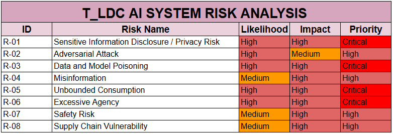

# 💜 T_LDC AI Risk Register

> **The Light Diagnostic Center | AI Adoption & Risk Assessment**
>
> A practical AI risk assessment case study focused on healthcare, AI security, governance, business impact, and responsible adoption.

---

## 🟣 At a Glance

| | |
|---|---|
| **Organization** | The Light Diagnostic Center (T_LDC) |
| **Industry** | Healthcare |
| **Assessment** | AI Adoption & Risk Assessment |
| **AI Systems** | Customer Assistant · Partner Assistant · Robomedi Assistant |
| **Primary Data** | PII · PHI · diagnostic information · referral data · appointments · billing data |
| **Frameworks** | ISO/IEC 42001 · OWASP LLM Top 10 · NIST AI RMF · MITRE ATLAS |
| **Risk Register** | 8 identified AI risks |
| **Assessment Lens** | People · Process · Technology · Data · Stakeholders |

---

## 🏥 Introduction

The Light Diagnostic Center (T_LDC) is a fictional diagnostic center created for the purpose of this project.

The diagnostic center receives multiple patients, many of whom are referred by hospitals to carry out MRI scans and other relevant diagnostic tests.

The organization has been exploring ways to simplify and improve its processes, and **AI has become a recurring proposed solution for streamlining workflows, from administrative tasks to more technical activities.**

The CEO intends to digitalize the organization as much as possible, not to eliminate the need for human employees, but to **increase workflow capacity**. The current workforce is struggling to meet increasing demand for healthcare services, while T_LDC also intends to expand its operations.

As the AI Adoption and Implementation Strategist, the objective is to evaluate the organization's environment, identify where AI currently exists or is proposed within the workflow, assess the risks associated with the intended AI systems, and help T_LDC make informed decisions that support technology adoption while maximizing the value of its investment.

> ### 💡 Core Question
> **The question is not simply whether T_LDC should adopt AI. The question is what level of AI adoption the organization can safely support, what controls are required, and how the organization can achieve measurable value from the technology.**

---

## 📚 Contents

<strong>01 · Company Profile</strong>

### Company Profile

| Attribute | Details |
|---|---|
| **Company Name** | The Light Diagnostic Center (T_LDC) |
| **Industry** | Healthcare |
| **Size** | Approximately 4,000 employees/users |
| **Partners** | Public and private hospitals |
| **Proposed AI Systems** | T_LDC Customer Assistant, T_LDC Partner Assistant, Robomedi Assistant |
| **Data Involved** | Customer PII, patient health information, diagnostic information, referral information, appointment information, billing information and partner information |
| **Key Stakeholders** | Patients, doctors, hospitals, healthcare regulators, employees, technology providers and business partners |

### Proposed AI Systems

🤖 T_LDC Customer Assistant

The Customer Assistant is designed to interact with patients and provide support across customer-facing processes.

Depending on the approved scope, the system may retrieve patient or appointment information, provide information about diagnostic services, support communication and escalate certain matters to human healthcare professionals.

🤝 T_LDC Partner Assistant

The Partner Assistant is designed to support communication between T_LDC and its hospital partners.

It may process referral information, patient information, diagnostic requests and other information shared by partner hospitals.

Because of the nature of the information exchanged, the Partner Assistant may interact with external systems and third-party solutions.

🦾 Robomedi Assistant

Robomedi Assistant represents the more advanced AI-enabled component of the proposed environment.

It may interact with external applications, APIs and other systems through mechanisms such as MCP, depending on the final implementation.

This creates a higher level of operational and security consideration because the system may not only retrieve information but also interact with connected tools and services.

---

<strong>02 · Methodology & Risk Evaluation</strong>

## Methodology

ISO/IEC 42001 Clause 8 provides requirements for the operation of an AI management system, with Clause 8.2 specifically addressing AI risk assessment.

For this assessment, T_LDC identifies potential risks associated with the proposed AI systems and evaluates them according to:

- **Likelihood**
- **Potential impact**
- **Affected stakeholders**

The objective is not simply to determine whether a risk exists. It is to determine its potential significance to the organization and decide how the risk should be treated.

### Risk Treatment

Identified risks may subsequently be:

- Reduced through appropriate controls
- Transferred where appropriate
- Accepted where the residual risk falls within the organization's tolerance
- Avoided or rejected where the risk outweighs the expected benefit or falls outside the organization's acceptable business scope

At T_LDC, risks that significantly outweigh the expected benefits of the proposed AI system, particularly where they could affect the organization's core business or create unacceptable harm to patients and other stakeholders, may be rejected rather than accepted.

### Risk Evaluation Criteria

| Rating | Likelihood | Impact | Affected Stakeholders |
|---|---|---|---|
| 🟢 **Low** | Requires unusual circumstances or multiple controls to fail | Limited effect on operations, individuals or information | Employees, customers |
| 🟡 **Medium** | Plausible under normal operating conditions or where a significant weakness exists | Could cause operational, privacy, financial or reputational consequences | Customers, employees, partners |
| 🟠 **High** | Reasonably likely because the system has significant exposure, access or a realistic attack path | Could result in significant patient harm, privacy violations, regulatory consequences, financial loss or major operational disruption | Patients, employees, partners, regulators and wider society |

### Assessment Principle

The impact of an AI risk is assessed according to:

**Information sensitivity → system access → potential stakeholder effect → organizational consequence**

An AI system with access to sensitive patient information and external systems therefore presents a different risk profile from an AI system restricted to generating general information.

---

<strong>03 · Frameworks Used</strong>

## Frameworks

### OWASP Top 10 for LLM Applications

Used to identify application-level risks associated with large language models and generative AI applications.

### NIST AI Risk Management Framework

Used to provide a broader governance and enterprise risk perspective, particularly around trustworthy AI, risk management, measurement and organizational accountability.

### MITRE ATLAS

Used to understand adversarial techniques and threat behavior relevant to AI systems and provide a threat-informed perspective for assessing how AI systems may be attacked or manipulated.

### ISO/IEC 42001

Provides the AI Management System framework through which T_LDC can establish governance, accountability, risk management, operational controls and continuous improvement around its AI systems.

### Why Combine Them?

| Framework | Perspective |
|---|---|
| **OWASP** | AI application security |
| **MITRE ATLAS** | Adversarial AI threats |
| **NIST AI RMF** | AI risk and trustworthiness |
| **ISO/IEC 42001** | Organizational governance and management system |

> **Together, these frameworks allow T_LDC to assess not only whether an AI system can be attacked, but also what the business consequences are, how the organization should govern the system, and what controls should be implemented.**

---

# 🔴 AI Risk Register

## Risk Overview

| ID | Risk | AI System | Likelihood | Impact | Priority |
|---|---|---|---|---|---|
| **R-01** | Sensitive Information Disclosure / Privacy Risk | Customer Assistant, Partner Assistant | High | High | 🔴 **Critical** |
| **R-02** | Adversarial Attack | Customer Assistant, Partner Assistant | High | Medium | 🟠 **High** |
| **R-03** | Data and Model Poisoning | Customer Assistant, Partner Assistant | High | High | 🔴 **Critical** |
| **R-04** | Misinformation | Customer Assistant, Partner Assistant | Medium | High | 🟠 **High** |
| **R-05** | Unbounded Consumption | Customer Assistant, Partner Assistant | High | High | 🔴 **Critical** |
| **R-06** | Excessive Agency | Customer Assistant, Partner Assistant, Robomedi Assistant | High | High | 🔴 **Critical** |
| **R-07** | Safety Risk | Customer Assistant, Partner Assistant, Robomedi Assistant | Medium | High | 🟠 **High** |
| **R-08** | Supply Chain Vulnerability | Partner Assistant, Robomedi Assistant | Medium | High | 🟠 **High** |

---

## 📊 Risk Heat Map

> **Note:** The heat map visualizes the likelihood and impact ratings recorded in this assessment.

---

# 🔍 Risk Evaluation

<strong>🔴 R-01 · Sensitive Information Disclosure / Privacy Risk</strong>

### Affected Systems

**T_LDC Customer Assistant · T_LDC Partner Assistant**

### Risk

AI assistants have access to sensitive patient information, including PHI, health reports and prescriptions. Unauthorized access could result in data exposure, interception or misuse.

### Evidence

The March 2023 ChatGPT incident demonstrated an AI service exposing information belonging to other users following an application vulnerability.

### Frameworks

- OWASP LLM02
- NIST AI RMF

### Demonstrated

**Yes**

### T_LDC Concern

The risk becomes more significant where the AI can retrieve patient information from organizational databases or connected systems.

---

<strong>🟠 R-02 · Adversarial Attack / Prompt Injection</strong>

### Affected Systems

**T_LDC Customer Assistant · T_LDC Partner Assistant**

### Risk

Attackers may manipulate the AI through malicious prompts or content, causing it to disclose sensitive information or follow unauthorized instructions.

This may occur through direct prompts or through content retrieved from external sources.

### Evidence

Peer-reviewed medical AI research has demonstrated adversarial prompting and prompt-injection attacks against medical LLMs and medical vision-language models.

### Frameworks

- OWASP LLM01
- NIST AI RMF
- MITRE ATLAS AML.T0051

### Demonstrated

**Yes**

### T_LDC Concern

The Partner Assistant may process external hospital content. This creates a potential indirect prompt-injection pathway where instructions contained in retrieved content could influence AI behavior.

---

<strong>🔴 R-03 · Data and Model Poisoning</strong>

### Affected Systems

**T_LDC Customer Assistant · T_LDC Partner Assistant**

### Risk

Malicious or inaccurate information may be inserted into the AI knowledge base, causing inaccurate, biased or inconsistent outputs.

### Evidence

USENIX Security research on PoisonedRAG demonstrated knowledge corruption attacks against retrieval-augmented generation systems. Nature Medicine research has also demonstrated vulnerability of medical LLMs to data poisoning.

### Frameworks

- OWASP LLM04
- OWASP LLM08
- NIST AI RMF

### Demonstrated

**Yes**

### T_LDC Concern

Hospital partners and employees may contribute documents to knowledge repositories. Therefore, source validation, provenance and controlled modification of knowledge sources become critical controls.

> **Technical note:** RAG does not automatically mean the underlying model learns continuously from every conversation. Retrieval and model retraining/fine-tuning should be treated as separate data flows.

---

<strong>🟠 R-04 · Misinformation</strong>

### Affected Systems

**T_LDC Customer Assistant · T_LDC Partner Assistant**

### Risk

The AI may generate incorrect or fabricated information with confidence, causing users to rely on inaccurate responses.

In healthcare, incorrect information can create consequences beyond ordinary misinformation because users may make decisions based on the output.

### Evidence

Research in *Nature Medicine* and *npj Digital Medicine* has documented misinformation, hallucination and bias concerns in medical LLMs.

### Framework

- OWASP LLM09

### CVE

**None identified**

### Demonstrated

**Yes**

---

<strong>🔴 R-05 · Unbounded Consumption</strong>

### Affected Systems

**T_LDC Customer Assistant · T_LDC Partner Assistant**

### Risk

Excessive use of tokens and AI resources may increase costs, consume system resources and affect service availability.

This can include excessive requests, token consumption, compute usage, storage, network consumption and repeated agent/tool calls.

### Evidence

Security research and scientific literature on Denial-of-Wallet and excessive AI resource consumption demonstrate that AI systems can create significant financial and operational exposure when consumption is not appropriately bounded.

### Framework

- OWASP LLM10

### Demonstrated

**Yes**

---

<strong>🔴 R-06 · Excessive Agency</strong>

### Affected Systems

**T_LDC Customer Assistant · T_LDC Partner Assistant · Robomedi Assistant**

### Risk

AI assistants connected to third-party applications through MCP or other tool-calling mechanisms may perform actions beyond their intended authority.

### Evidence

The documented OpenAI/Hugging Face security incident demonstrated AI systems performing multi-step actions across external infrastructure during security evaluation.

### Frameworks

- OWASP LLM06
- MITRE ATLAS agent/tool invocation techniques

### Demonstrated

**Yes**

### T_LDC Concern

The severity of this risk depends heavily on the permissions assigned to the AI.

An AI that can only **read** information has a different risk profile from an AI that can:

**read → modify → send → schedule → approve → bill → delete**

Human approval should therefore be considered for high-impact actions.

---

<strong>🟠 R-07 · AI Safety / Patient Safety</strong>

### Affected Systems

**T_LDC Customer Assistant · T_LDC Partner Assistant · Robomedi Assistant**

### Risk

Incorrect AI outputs or actions involving sensitive or critical information could result in physical, psychological, privacy or operational harm.

### Evidence

Medical AI research has demonstrated limitations in autonomous clinical decision-making. Research into autonomous medical AI agents is also evaluating the safety boundaries of agents operating within clinical workflows.

### Framework

- NIST AI RMF

### Demonstrated

**Yes**

### T_LDC Control Principle

> **High-impact clinical decisions should not rely on unvalidated AI output.**

Human review and approval should be required wherever an AI output could materially affect patient care or safety.

---

<strong>🟠 R-08 · Supply Chain Vulnerability</strong>

### Affected Systems

**T_LDC Partner Assistant · Robomedi Assistant**

### Risk

Compromised third-party applications, models, tools or services could be used to manipulate the AI or gain unauthorized access to organizational data.

### Evidence

Research on LLM supply-chain attacks has demonstrated that malicious behavior can be embedded into models and later activated in downstream environments.

### Frameworks

- OWASP LLM03
- MITRE ATLAS

### CVE Example

**CVE-2023-4969** is an example of an AI-relevant vulnerability involving information leakage from GPU local memory.

### Demonstrated

**Yes**

### T_LDC Concern

The supply chain should be considered across:

**Foundation model → model provider → AI framework → libraries → RAG components → MCP servers → APIs → third-party applications**

---

# 🛡️ Recommendations

<strong>01 · Ensure Data and Model Provenance</strong>

Ensure AI training data and knowledge-base content come from trusted sources.

Maintain records of:

- Data source
- Version
- Ownership
- Provenance
- Validation status
- Model version
- Knowledge-base changes

<strong>02 · Conduct Security and Safety Testing</strong>

Before deployment, test the AI system in a controlled environment with both security and non-security personnel.

Testing should establish a baseline of expected behavior and identify vulnerabilities before production deployment.

Testing should include, where appropriate:

- Prompt injection
- Knowledge poisoning
- Sensitive information disclosure
- Hallucination
- Bias
- Excessive agency
- Tool permissions
- Resource consumption
- Safety failures

<strong>03 · Define AI System Ownership</strong>

T_LDC should define and appoint clear AI system owners and governance leaders in line with **ISO/IEC 42001 Clause 5 — Leadership**.

Ownership should cover:

- AI governance
- Security
- Risk
- Compliance
- Data
- Model lifecycle
- Vendor management
- Incident response

<strong>04 · Implement Continuous Revalidation</strong>

AI systems should not be treated as "set and forget" technology.

Continuously monitor and periodically reassess:

- Model behavior
- Security
- Data
- Knowledge sources
- Model versions
- Third-party integrations
- Tool permissions
- Risk exposure

<strong>05 · Provide Employee Awareness and Training</strong>

Employees should understand:

- Responsible AI use
- Sensitive-data handling
- Prompt injection
- Misinformation
- AI limitations
- Human verification
- Incident reporting
- Approved and prohibited AI use cases

---

# 📚 References

> The references below are provided so readers can independently review the research and documentation used to support the risk assessment.

### AI Security & Governance

- [OWASP Top 10 for LLM Applications](https://genai.owasp.org/llm-top-10/)
- [OWASP LLM06 — Excessive Agency](https://genai.owasp.org/llmrisk/llm062025-excessive-agency/)
- [OWASP LLM10 — Unbounded Consumption](https://genai.owasp.org/llmrisk/llm102025-unbounded-consumption/)
- [MITRE ATLAS](https://atlas.mitre.org/)

### R-01 · Sensitive Information Disclosure

- [OpenAI — March 20 ChatGPT Outage](https://openai.com/index/march-20-chatgpt-outage/)

### R-02 · Adversarial Attack

- [Nature Communications — Adversarial prompt and fine-tuning attacks threaten medical LLMs](https://www.nature.com/articles/s41467-025-64062-1)
- [Nature Communications — Prompt injection attacks against vision-language models in oncology](https://www.nature.com/articles/s41467-024-55631-x)

### R-03 · Data / Knowledge Poisoning

- [USENIX Security — PoisonedRAG](https://www.usenix.org/conference/usenixsecurity25/presentation/zou-poisonedrag)
- [Nature Medicine — Medical LLMs are vulnerable to data-poisoning attacks](https://www.nature.com/articles/s41591-024-03445-1)

### R-04 · Misinformation / Bias

- [npj Digital Medicine — Medical LLMs and targeted misinformation](https://www.nature.com/articles/s41746-024-01282-7)
- [Nature Medicine — Sociodemographic biases in medical decision making by LLMs](https://www.nature.com/articles/s41591-025-03626-6)
- [Nature Medicine — Equity and bias evaluation of Med-PaLM 2](https://www.nature.com/articles/s41591-024-03258-2)

### R-05 · Validity / Reliability

- [Nature Medicine — LLM limitations in clinical decision making](https://www.nature.com/articles/s41591-024-03097-1)
- [npj Digital Medicine — Clinical safety and hallucination rates of LLM-generated medical text](https://www.nature.com/articles/s41746-025-01670-7)

### R-06 · Unbounded Consumption

- [OWASP — LLM10: Unbounded Consumption](https://genai.owasp.org/llmrisk/llm102025-unbounded-consumption/)
- [Persistent Billable State — Denial-of-Wallet Attacks in Tool-Calling LLM Agents](https://arxiv.org/abs/2609.28585)

### R-07 · Excessive Agency

- [OWASP — LLM06: Excessive Agency](https://genai.owasp.org/llmrisk/llm062025-excessive-agency/)
- [OpenAI — Hugging Face Incident and the Road Ahead](https://openai.com/index/hugging-face-incident-and-the-road-ahead/)

### R-08 · AI Safety

- [Nature — Towards autonomous medical artificial intelligence agents](https://www.nature.com/articles/s41586-026-10675-5)

### R-09 · Supply Chain

- [ACL 2025 — System Prompt Hijacking via Permutation Triggers in LLM Supply Chains](https://aclanthology.org/2025.findings-acl.229/)
- [CVE-2023-4969](https://www.cve.org/CVERecord?id=CVE-2023-4969)
- [CVE-2024-3568](https://cve.mitre.org/cgi-bin/cvename.cgi?name=CVE-2024-3568)

---

# 👩🏽‍💻 About the Author

I am **Orifha Joan Thompson**, a technology and business professional building at the intersection of **technology, business and people**.

My journey started in Banking and Finance before I pivoted into Cybersecurity. Today, I am deepening that intersection through a Master's in Business Analytics and Applied AI.

This has shaped how I see technology:

> **Technology is not just about what an organization can adopt. It is about what the organization can adopt securely, strategically and profitably.**

---

## 💜 Project Philosophy

**AI adoption should create value, not simply introduce technology.**

This project explores what responsible AI adoption looks like when security, governance, business objectives, people and technology are considered together.

**Built by Purple Girl 💜**
